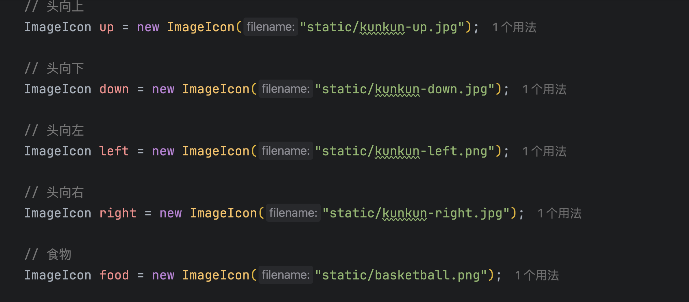

## 前言

有一句话叫做：

> “学哲学一定要过康德之桥。”

意思是康德是哲学路上的两个分水岭，这座桥分割了两个截然不同的世界。

在桥的一头是被绝大多数人视为常识的且无条件接受的实在论，在这种世界观下，物质微粒依赖物理规律构成世间万物以及人类，并且这些物质都客观存在于一个被称为宇宙时空的巨大箱子里。

在桥的另一头说德国古典观念论的起点，无数伟大的思想都从这里起步，康德、费希尔、黑格尔，最后在教科书上唯物史观的马克思都继承自观念论。

康德作为一座桥，标志了人们在认识世界方式上的根本转向。

在康德之前，哲学家们争论的焦点主要集中在“人的知识从何而来”这一问题上。其中分出了两个流派：唯理论和经验论。

唯理论认为人的知识只能来源于理性，而且知识本身就包含在理性里，就想数学，只要拿出笔在纸上演算就能得出真理。

经验论认为知识需要经过经验的检验，一切知识都在建立在经验的基础上，想要获取知识就必须走出家门，去观察，去做实验。

《纯粹理性批判》就是为了解决这个争论，而整个《纯粹理性批判》实际上是康德再向人们展示人类心灵这个程序是如何通过编程和代码从一片空白的文档开始，一步一步加载出我们身处的大千世界。

借着我写的一个贪吃蛇小游戏来解释人类心灵这个程序是怎么运行的。

  

## 感性

  

在这段代码中，使用了`new ImageIcon`方法把图片资源加载到了程序当中，`new ImageIcon`就是康德所说的直观。

> 无论一种知识以什么方式以及通过什么手段与对象发生关系，它与对象直接发生关系所凭借的以及一切思维当作手段所追求的，就是直观。

感官所给出的所有信号，味觉、嗅觉、听觉，我们将外部对象给出的刺激呈现在意识领域内的手段就是直观。康德将这一能力统称为感性。

对应到游戏里，游戏源文件中的各种素材，都需要通过`new ImageIcon`这种方法才能添加到游戏的主程序中，当只有`new ImageIcon`，这些原始素材不但不能活动，甚至连呈现都做不到，因为此时的游戏还没有主界面。

  

  

这里涉及到两块同样重要的代码，它们分别对应着康德的空间和时间，这里的空间和时间已经不同于日常生活中的、处在我们的、物理学意义上的时空。

简而言之，康德认为，在我们去感受外部时空之前，我们的意识中必须先内置时空的表象，要呈现外部接受到的各种刺激，我们必须先内置一个能够提供各种刺激在其中排布变化的意识空间，也就是说我们必须先通过内置的代码展开一个游戏窗口。康德认为，没有一个任何一个直观到的表象可以脱离空间和时间。

可以试着闭上眼睛想象一个圆形和方形，要么圆形和方形相互并列，要么圆形和方形相互嵌套或重叠，并且两个表象永远在你展开的意识空间里，没有这个预制的意识空间你根本无法做出任何相应的直观。你能想象什么都没有，却无法想象没有空间，当你开始想，你就意识到属于你的游戏窗口是永远敞开的状态。

时间也相同，时间表象是我们连续绵延意识体验的基础，你听到或是想到的任何一个声响，体验到的任何一个变化，都以内时间表象为基础，我们体验到的每一个瞬间，都包含了上一时间的延续和下一时间的承接。如果我们不是先天地意识内就具有一种能象征并记录一切变化的能力，那外界的时间再如何流逝跟我们也没任何关系。

时间和空间具有先验性，是一切直观的前提条件。时间与空间并不是我们通过经验学到的外部属性，而是先于经验内置于我们主体性的固有代码。

经验论认为游戏是有原始素材构成，只要有足够的素材，就能拼出一款游戏。唯理论认为素材根本无所谓，只要埋头苦敲就能编出游戏。

至此，程序中已经有了若干从外部提取的素材，一块呈现素材的窗口，以及让素材呈现发生变化的内部时钟。但距离能称得上是游戏，还差的很远。接下来就轮到知性发挥作用了。

## 知性

感性只有直观的能力，感性只负责将对象产生的刺激带到意识中，而知性则负责对感性直观到的素材进行加工。这两种能力相辅相成。

> 无感性就不会有对象被给予我们，无知性就不会有对象被思维。

不妨看一眼窗外的景色，我们直观了这么庞杂的表象，无数的色块和线条相互堆叠，但眼前的一切看起来仍然井然有序，究其原因，是因为这些感性的素材并非孤立地呈现在我们意识中，而是经过了编码，封装成了一个个能被我们把握的对象。我们接受到的不是孤立的线条、色块、和声波的振动，而是一颗颗树木、一栋栋楼宇、一声声交谈，这种将感性疯长成具体对象的能力，也就是知性。

回到贪球坤的游戏里，我们从程序外提取到的素材其实没有任何意义，它们无非是以特定的方式排列好的像素点而且，为了区分出身体以及食物，程序员需要创造出两个对象。当创造出身体，食物的对象后，下一步就是把这些对象融入到游戏的主程序中，进一步去规定这些对象之间的关系。比如头部与身体接触会如何，如果碰到墙壁又会如何。

现实中也是一样，知性以类似的方式构建起人们对世界的认识。好比我们路过一个水果摊，知性便把感性直观到的各种颜色和形状封装成相应的水果对象，对象拥有类别、颜色、味道、形状等各种属性，同时还将水果这些对象跟我们联系在一起，比如喜恶关系、空间距离关系、所有权关系等。“苹果有益健康”、“苹果归水果摊所有”、“我要支付一定的金钱才能拥有这个苹果”，诸如此类的判断就是知性运行的结果。这些判断支撑起了每个人各自的那个大千世界。

人的心灵并非是对外界的直接一比一的反应，我们眼中的苹果并非本来就是苹果本身，相反，一个人感受到的世界是由知性的判断搭建起来的，正如贪球坤游戏并不是真的吃到了球，而是底层经过编码各种对象间的相互关系。

## 理性

理性-人类最高认识能力的终极体现。

感性的对象是外界的各种刺激，知性则加工感性的素材得到判断，而理性所要探索的，是全知性共同遵守的普遍法则。放在游戏里，感性负责加载原始素材，知性是一行行敲出来的代码规定对象与对象间的关系，而理性，就是代码本身，或者说是每一行代码背后必须要遵守的那个基础规则。知性让我们产生认识，理性则要探索我们为什么能产生认识？这些认识产生的条件是什么？ 康德举了一个立法过程的例子来解释理性：如果把社会上实际发生的事件看做感性材料，比如说具体的一桩桩诈骗、抢劫、偷窃事件，那么我们通过立法对这些事件做出的规定就是知性，比如装订成册的宪法、刑法、民法，而理性，则是我们在立法时遵守的那个普遍原则，可以理解成公正、民主、和谐这类指导法律方向的普世价值。那么知性遵守什么法则呢，通过理性的工作，康德给出了他答案，那就是范畴。

  

康德认为知性的一切活动都囊括在以上的4个大类，分别是量、制、关系以及模态之中。每个大类又区分出3个小类，一共12个范畴。每一个范畴代表了一种基本的判断形式。康德也解释不了为什么只能是这12个范畴。康德认为知性通过判断将我们认识的世界组织起来，而理性通过对判断分类得出范畴表。

对应编程，范畴表可以理解为代码大全或是终极源代码一类的东西。

当理性在面对一些特定的概念时会遇到怎么都无法解决的悖论，悖论的正方和反方在人的理性看来都同样有说服力，这样的悖论就是二律背反。

|                      正题                      |                       反题                       |
| :--------------------------------------------: | :----------------------------------------------: |
|     宇宙在时间上有起点，在空间上也是有限的     |   宇宙在时间上没有起点，在空间中也没有任何限制   |
| 所有事物都无限可分，不存在一个不可分的基本粒子 | 所有事物都不可无限可分，存在一个不可分的基本粒子 |
|        在自然法则外，世上还存在自由意识        |        不存在自由意识，世上的一切都是必然        |
|     存在一个绝对者（上帝）是这个世界的成因     |        这个世界没有绝对者（上帝）作为成因        |

康德在《纯粹理性批判》中提出了以上四组二律背反。时空，物质，自由意识和上帝，在康德的时代代表了一种那时的形而上学对终极知识的追求。但理性却对这些问题毫无办法。

康德认为四组二律背反分别是对四个对象做判断，但这四个对象都不能在我们的经验中出现，过去未来的时空，基本粒子，因果关系和上帝，从来只是一种推论，或者说它们是超验的，是超出经验范围内的，而我们的知性范畴只能处理经验中的对象，当运用与经验的范畴遇上了超验的对象自然就产生了二律背反的幻想。康德认为，二律背反产生的原因是超出正反题之外的。就像盲人摸象，一个人摸到象牙说大象是硬的，一个人摸到象耳说大象是软的，于是开始争论大象是硬的还是软的，但拥有视觉的人知道，大象是什么，根本是无关软硬度关系，是因为那两个盲人只有软硬这个范畴才产生相应的争论。

在四个二律背反中，当我们讨论正题或反题时，人们就已经预设了时空、基本粒子、因果律和上帝是外在于我们心灵客观存在的对象，但在康德看来，我们永远无法知道什么是客观存在，我们永远无法知道世界本来的样子，就像一个程序员再精通编码，他也绝无可能将主板这些硬件呈现在屏幕上，我们能知道的，只有经过范畴编码的经验表象，而那个给我们以感性刺激的物自体则永远隐匿在经验之外。

同样，因果关系也是我们连接经验表象的编码方式，物自体之间的关系也永远对我们隐匿，这就是康德对理性的批判。康德给理性花了一条界限并告诉我们，人只能认识界限以内的对象。可以把宇宙想象成一个装了最高级系统的主机，而每个人的心灵则是主机上运行的虚拟机，虚拟机从主机那只能接受与虚拟机系统兼容的数据，当我们在虚拟机内部试图用虚拟机的系统去探索主机上的对象时，不兼容的幻想就产生了。所以，不是我们的认识要符合对象，是对象要符合我们的认识形式，不是电脑能运行游戏本身，而是游戏本身要与电脑系统兼容。

至此，认识论上的转向就完成了，康德之前的独断论者把宇宙看做客观存在的大箱子，物质则是箱子里摆放着的一件一件的物品，这些物品根据物理规律相互影响。而康德认为，时空是人的主观认识形式，对象的实存以及因果关系都是知性的判断，或者说客观存在和因果是我们对对象的一种编码，只是独断论者将这行代码赋予了比代码本身更优先的地位。

如果一个最简单的小游戏都要经过几百行代码的编程，那么我们的心灵凭什么像镜子一样直白的反映出眼前的大千世界呢？
