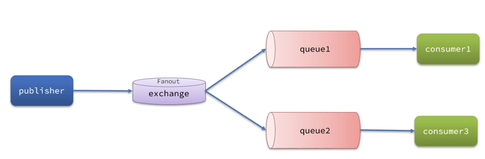

## RabbitMQ 核心概念及整体架构

- virtual-host：虚拟主机，起到数据隔离的作用。
- publisher：消息发送者。
- sconsumer：消息的消费者。
- queue：队列，存储消息。
- exchange：交换机，负责路由消息。

<div align="center">
  
</div>

## Springboot 项目使用 RabbitMQ

### 依赖引入

pom.xml：

~~~xml
<dependency>
	<groupId>org.springframework.boot</groupId>
	<artifactId>spring-boot-starter-amqp</artifactId>
</dependency>
<dependency>
	<groupId>com.fasterxml.jackson.core</groupId>
	<artifactId>jackson-databind</artifactId>
</dependency>
~~~

### 配置

application.yaml：

~~~yaml
spring:
  rabbitmq:
    host: localhost	
    port: 5672	
    username: guest	
    password: guest	
    virtual-host: /	
~~~

configuration 类配置序列化：

```java
@Configuration
public class RabbitMQMessageConfig {

    @Bean
    public MessageConverter messageConverter() {
        return new Jackson2JsonMessageConverter();
    }

}
```

### 测试

publisher 端代码：

```java
@SpringBootTest
class PublisherApplicationTests {

    @Resource
    private RabbitTemplate rabbitTemplate;

    @Test
    void testConnection() {
        // 队列名称
        String queueName = "test.queue";
        // 消息
        String message = "test";
        // 发送消息
        rabbitTemplate.convertAndSend(queueName, message);
    }

}
```

consumer 端代码：

```java
@Component
@Slf4j
public class TestListener {

    @RabbitListener(queues = "test.queue")
    public void listenTestQueue(String message) {
        System.out.println(message);
    }

}
```

## 声明队列和交换机的方式

### 配置类

示例代码：

```java
package com.mincai.study.consumer.config;

import org.springframework.amqp.core.*;
import org.springframework.context.annotation.Bean;
import org.springframework.context.annotation.Configuration;

/**
 * @author limincai
 */
@Configuration
public class FanoutConfig {

    /**
     * 声明 Fanout 交换机
     */
    @Bean
    public FanoutExchange fanoutExchange1() {
        // return ExchangeBuilder.fanoutExchange("exchange.fanout").build();
        return new FanoutExchange("exchange.fanout");
    }


    /**
     * 声明一个队列
     */
    @Bean
    public Queue fanoutQueue1() {
        // return QueueBuilder.durable("fanout.queue1").build();
        // 用下面这种方式，默认持久化
        return new Queue("fanout.queue1");
    }

    /**
     * 绑定队列1和交换机1
     */
    @Bean
    public Binding fanoutBuilding1(Queue fanoutQueue1, FanoutExchange fanoutExchange1) {
        return BindingBuilder.bind(fanoutQueue1).to(fanoutExchange1);
    }

}
```

### 注解

在监听的方法上使用 `@RabbitListener` 注解

示例代码：

```java
@Component
public class TestListener {

    @RabbitListener(
            bindings = @QueueBinding(
            // 绑定的队列
            value = @Queue(value = "fanout.queue1", durable = "true"),
            // 绑定的交换机
            exchange = @Exchange(value = "fanout.exchange1", type = ExchangeTypes.FANOUT),
            // Binging Key
            key = "fanoutkey"))
    public void listenFanoutQueue1(String message) {
        System.err.println("消费者1收到了 fanout queue1 的消息：" + message);
    }
}
```

## Work Queues

让多个消费者绑定到一个队列，共同消费队列中的消息。

<div align="center">
  </image>
</div>

### 测试

publisher 端代码：

```java
@SpringBootTest
class PublisherApplicationTests {

    @Resource
    private RabbitTemplate rabbitTemplate;

    @Test
    void testWorkQueue() throws InterruptedException {
        // 队列名称
        String queueName = "work.queue";
        for (int i = 0; i < 50; i++) {
            // 消息
            String message = "hello,message_" + i;
            // 发送消息
            rabbitTemplate.convertAndSend(queueName, message);
            Thread.sleep(20);
        }
    }

}
```

consumer 端代码：

```java
@Component
@Slf4j
public class TestListener {
  
    @RabbitListener(queues = "work.queue")
    public void listenWorkQueue1(String message) {
        System.out.println("消费者1收到了 work queue 的消息：" + message);
    }

    @RabbitListener(queues = "work.queue")
    public void listenWorkQueue2(String message) {
        System.err.println("消费者2收到了 work queue 的消息：" + message);
    }
}
```

消费者1和消费者2轮询消费了 work.queue 中的消息。

默认情况下，RabbitMQ 会将消息轮询投递给绑定在队列上的每一个消费者。可以修改 consumer 的配置，将 prefetch 设置为1，确保同一时刻最多投递给消费者1条消息：

```yaml
spring:
  rabbitmq:
    listener:
      simple:
      	# 每次只能获取一条消息，处理完成才能获取下一条消息
        prefetch: 1 
```

## Fanout 交换机

Fanout Exchange 会将接收到的消息广播到每一个跟其绑定的 queue。

<div align="center">
  </image>
</div>

### 测试

publisher 端代码：

```java
@SpringBootTest
class PublisherApplicationTests {

    @Resource
    private RabbitTemplate rabbitTemplate;
  
    @Test
    void testFanoutExchange() {
        // 交换机名称
        String exchangeName = "fanout.exchange";
        // 消息
        String message = "hello,fanout exchange";
        // 发送消息
        rabbitTemplate.convertAndSend(exchangeName, "", message);
    }

}

```

consumer 端代码：

```java
@Component
@Slf4j
public class TestListener {

    @RabbitListener(queues = "fanout.queue1")
    public void listenFanoutQueue1(String message) {
        System.out.println("消费者1收到了 fanout queue1 的消息：" + message);
    }

    @RabbitListener(queues = "fanout.queue2")
    public void listenFanoutQueue2(String message) {
        System.out.println("消费者2收到了 fanout queue2 的消息：" + message);
    }
}
```

## Direct 交换机

Direct Exchange 会将收到的消息根据规则路由到指定的 queue。

- 每一个 queue 都与 Exchange 绑定一个 Binging Key。
- 发布者发送消息时，指定消息的 Routing Key。
- Exchange 将消息路由到 Binging Key 与消息 Routing Key 一致的队列。

<div align="center">
  </image>
</div>

### 测试

publisher 端代码：

```java
@SpringBootTest
class PublisherApplicationTests {

    @Resource
    private RabbitTemplate rabbitTemplate;

    @Test
    void testDirectExchange() {
        // 交换机名称
        String exchangeName = "direct.exchange";
        // routing key
        String routingKey = "blue";
        // 消息
        String message = "hello,direct exchange";
        // 发送消息
        rabbitTemplate.convertAndSend(exchangeName, routingKey, message);
    }
}
```

consumer 端代码：

```java
@Component
@Slf4j
public class TestListener {

    @RabbitListener(
            bindings = 
            @QueueBinding(
            value = @Queue(
            value = "direct.queue1", durable = "true"),
            exchange = @Exchange(value = "direct.exchange", type = "direct"),
            key = {"red"}))
    public void listenDirectQueue1(String message) {
        System.out.println("消费者1收到了 direct queue1 的消息：" + message);
    }

    @RabbitListener(
            bindings = 
            @QueueBinding(
            value = @Queue(
            value = "direct.queue2", durable = "true"),
            exchange = @Exchange(value = "direct.exchange", type = "direct"),
            key = {"yellow"}))
    public void listenDirectQueue2(String message) {
        System.err.println("消费者2收到了 direct queue2 的消息：" + message);
    }
  
}
```

## Topic 交换机

Topic Exchange 与 Direct Exchange 类似，区别在于 Binging Key 可以有更多规则。

- #：代指0个单词。
- *：代指1个单词。

### 测试

publisher 端代码：

```java
@SpringBootTest
class PublisherApplicationTests {

    @Resource
    private RabbitTemplate rabbitTemplate;
  
    @Test
    void testTopicExchange() {
        // 交换机名称
        String exchangeName = "topic.exchange";
        // routing key
        String routingKey = "china.news";
        // 消息
        String message = "hello,topic exchange";
        // 发送消息
        rabbitTemplate.convertAndSend(exchangeName, routingKey, message);
    }
}
```

consumer 端代码：

```java
@Component
@Slf4j
public class TestListener {

    @RabbitListener(
      bindings = @QueueBinding(
      value = @Queue(value = "topic.queue1", durable = "true"),
      exchange = @Exchange(value = "direct.exchange", type = ExchangeTypes.TOPIC),
      key = "#.news"))
    public void listenTopicQueue1(String message) {
        System.out.println("消费者1收到了 topic queue1 的消息：" + message);
    }

    @RabbitListener(
            bindings = @QueueBinding(
            value = @Queue(value = "topic.queue2", durable = "true"),
            exchange = @Exchange(value = "direct.exchange", type = ExchangeTypes.TOPIC),
            key = "china.#"))
    public void listenTopicQueue2(String message) {
        System.err.println("消费者2收到了 topic queue2 的消息：" + message);
    }
}
```
