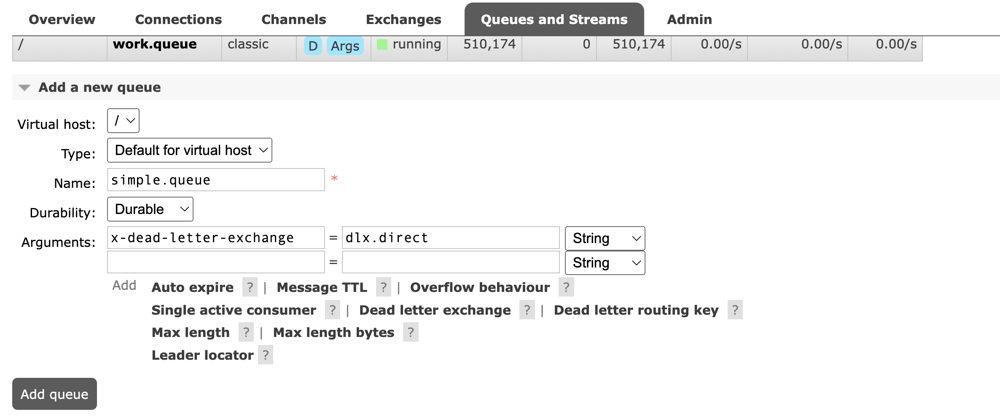
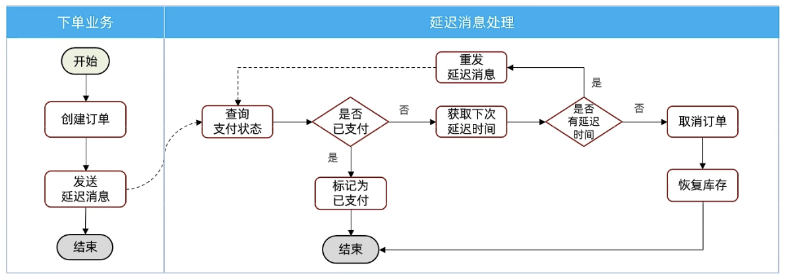

**延迟消息**：生产者发送消息是指定一个时间，消费者不会立刻收到消息，而是在指定时间之后才收到消息。

**延迟消息**：设置在一定时间之后才执行的任务。

## 死信交换机

当一个队列满足下列情况之一时，就会变成**死信**（dead letter）：

- 消费者使用 basic.reject 或 basic.nack 声明消费失败，并且消息的 requeue 参数为 false。
- 消息是一个过期消息（达到了队列或消息本身设置的过期时间），超时无人消费。
- 要投递的队列消息堆积满了，最早的消息可能成为死信。

如果队列通过 dead-letter-exchaneg 属性指定了一个队列，那么该队列中的死信就会投递到这个交换机中。这个交换机成为**死信交换机**（Dead Letter Exchange）。

<div align="center">
  
</div>

publisher 端代码：

```java
@SpringBootTest
@Slf4j
class PublisherApplicationTests {

    @Resource
    private RabbitTemplate rabbitTemplate;

    @Test
    void testDlxQueue() {
        // 交换机
        String exchangeName = "simple.direct";

        // routing key
        String routingKey = "hi";

        // 发送消息
        rabbitTemplate.convertAndSend(exchangeName, routingKey, "死信队列消息", message -> {
            // 设置过期时间，单位为 ms
            message.getMessageProperties().setExpiration("1000");
            return message;
        });
    }
}
```

consumer 端代码：

```java
@Component
@Slf4j
public class TestListener {

    @RabbitListener(queues = "dlx.queue")
    public void listenDlxQueue(String message) {
        log.info("处理死信队列的消息");
        log.info("dlx.queue 的消息：{}", message);
    }
}
```

消费者不需要监听 simple.queue 的队列，simple.queue 的消息会自动被监听 dlx.queue 的消费者给消费掉。

这种方式实现延迟队列，只有位于顶端的消息先被消费后才能消费下一个消息。比较不推荐。

## 延迟消息插件

RabbitMQ 推出了一个插件，原生支持延迟消息功能。

延迟消息插件安装：[github地址](https://github.com/rabbitmq/rabbitmq-delayed-message-exchange)。

（1）先找到 RabbitMQ 安装插件位置：

```cmd
rabbitmq-plugins directories -s
```

（2）把下载好的插件解压到文件夹内后启动插件：

```cmd
rabbitmq-plugins enable rabbitmq_delayed_message_exchange
```

消费者在声明交换机时，需要把 exchange 的 delayed 属性改为 true。

```java
@Component
@Slf4j
public class TestListener {

    @RabbitListener(
            bindings = @QueueBinding(
            value = @Queue(name = "dlx.queue", durable = "true"),
            exchange = @Exchange(name = "dlx.direct", delayed = "true"),
            key = "hi"
            )
    )
    public void listenDlxQueue(String message) {
        log.info("处理死信队列的消息");
        log.info("dlx.queue 的消息：{}", message);
    }
}
```

生产者在设置消息的过期时间方式也有所改变。

```java
@SpringBootTest
@Slf4j
class PublisherApplicationTests {

    @Resource
    private RabbitTemplate rabbitTemplate;

    @Test
    void testDlxQueue() {
        // 交换机
        String exchangeName = "simple.direct";

        // routing key
        String routingKey = "hi";

        // 发送消息
        rabbitTemplate.convertAndSend(exchangeName, routingKey, "死信队列消息", message -> {
            // 设置过期时间，单位为 ms
            message.getMessageProperties().setDelay(1000);
            return message;
        });
    }
}
```

这种方式设计的延迟队列，消息会根据过期时间从队列中取出。

## 延迟消息解决思路

延迟消息因为有过期时间的特性，当过期时间过长时，会导致队列堆积大量消息，浪费资源。

例如支付业务，30分钟未支付就会取消订单，大部分用户会在30分钟内支付订单，可以将30分钟分成数个时间段，每隔一段时间发送一次延迟消息，检查一下订单状态，减少没必要的等待，如果未支付继续发送一定时间的延迟消息，直到30分钟为止。

<div align="center">
  
</div>