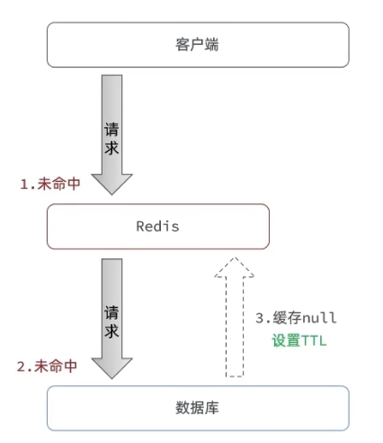
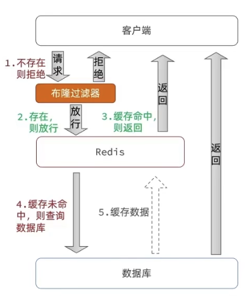
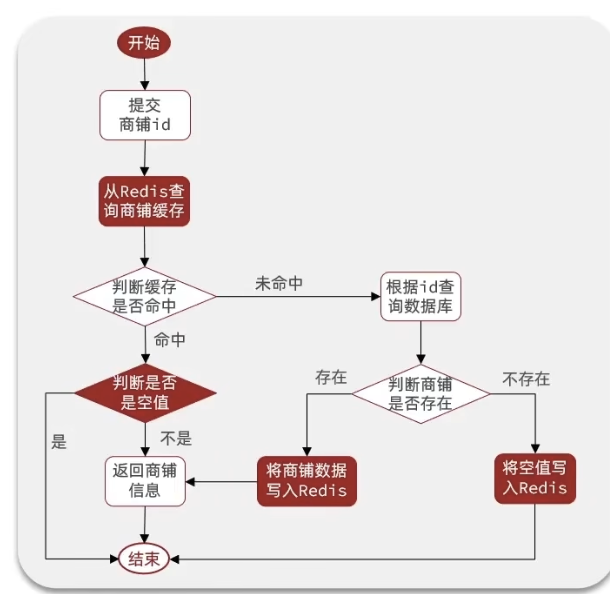
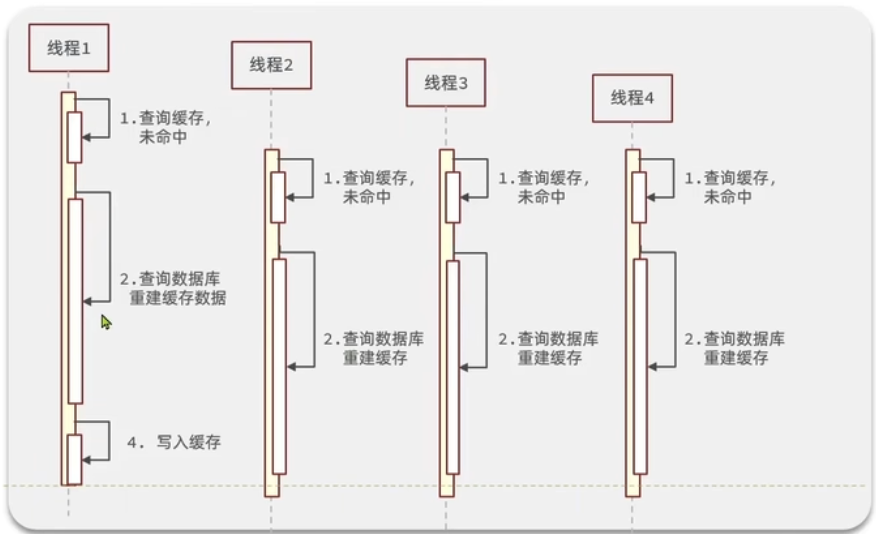
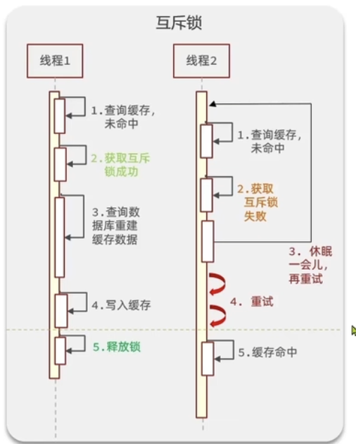
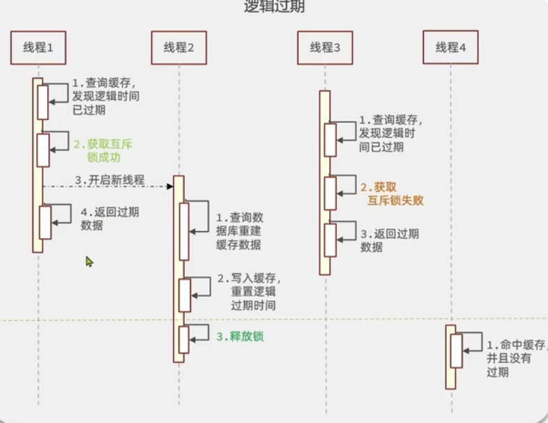
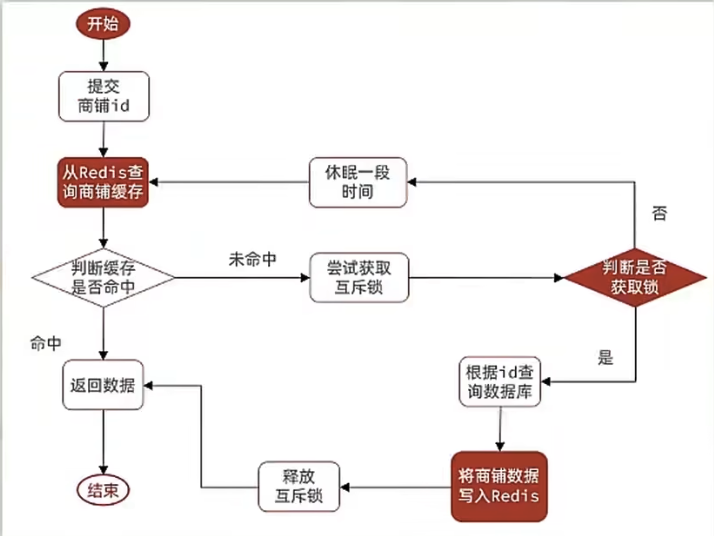
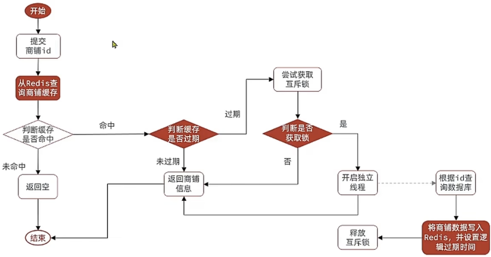

## 缓存穿透

**缓存穿透**：指查询一个不存在的数据，缓存中没有相应的记录，每次请求都会去访问数据库，使数据库负担加大。

### 解决方案

- 缓存空数据，对查询结果进行缓存，即使是不存在的数据，也可以缓存一个标识，以减少对数据库的请求。

  

- 使用布隆过滤器，过滤到不存在的请求，避免直接访问数据库。

  

### 解决方案对比

|  解决方案  |            优点            |                  缺点                   |
| :--------: | :------------------------: | :-------------------------------------: |
| 缓存空对象 |  实现简单，方便维护    | 额外的内存消耗 可能造成短期的不一致 |
| 布隆过滤器 | 内存占用较小，没有多余 key |     实现复杂 存在误判可能       |

### 缓存空对象 Java 实现

流程图：

  

Java 业务代码：

~~~java
/**
 * @author limincai
 */
@Service
public class GoodServiceImpl extends ServiceImpl<GoodMapper, Good> implements GoodService {
  
    @Resource
    private StringRedisTemplate stringRedisTemplate;

    @Override
    public Good getGood(Integer goodId) {
        String key = "good:" + goodId;
        // 1.从 redis 中查询商品缓存
        String goodJson = stringRedisTemplate.opsForValue().get(key);
        // 2.判断是否存在
        if (StrUtil.isNotBlank(goodJson)) {
            // 存在直接返回
            return JSONUtil.toBean(goodJson, Good.class);
        }
        // 3.判断命中的是否是空值
        if (goodJson != null) {
            // 是则直接返回空值
            return null;
        }
        // 4.不存在，查询数据库
        Good good = getById(goodId);
        // 5.数据库中不存在，则将空值写入 redis 并设置过期时间
        if (good == null) {
            stringRedisTemplate.opsForValue().set(key, "", 30, TimeUnit.SECONDS);
            return null;
        }
        // 6.数据库中存在，则重建缓存
        stringRedisTemplate.opsForValue().set(key, JSONUtil.toJsonStr(good), 30, TimeUnit.SECONDS);
        return good;
    }
}
~~~

## 缓存击穿

**缓存击穿**：指某个热点数据在缓存中失效，导致大量请求直接访问数据库。此时，由于瞬间的高并发，可能导致数据库崩溃。

### 解决方案

- 使用互斥锁，确保同一时间只有一个请求可以去数据库查询并更新缓存。当缓存未命中时，当前线程获得锁并去查询数据库重新缓存数据。缺点是性能较差，当前线程拿到互斥锁时，其他线程只能等待。

  

- 逻辑过期，热点数据永不过期。若当前线程发现数据逻辑时间已过期，就去获得互斥锁，并开启一个新的线程去查询数据库重新建立缓存，并返回已过期的数据。当其他线程获取互斥锁失败时，直接返回过期数据。当缓存重新建立时，此时释放锁，其他线程可以直接命中缓存。

  

### 解决方案对比

| 解决方案 |                     优点                     |                     缺点                     |
| :------: | :------------------------------------------: | :------------------------------------------: |
|  互斥锁  | 没有额外内存消耗 保证一致性 实现简单 |     没有额外内存消耗 可能有死锁风险      |
| 逻辑过期 |                 线程无需等待                 | 不保证一致性 有额外内存消耗 实现复杂 |

### 互斥锁 Java 实现

流程图：

  

Java 业务代码：

其中 `tryLock()` 和 `unLock()` 可以使用 `ReentrantLock` 对象的 `tryLock()` 和 `unLock()` 方法

~~~java
/**
 * @author limincai
 */
@Service
public class GoodServiceImpl extends ServiceImpl<GoodMapper, Good> implements GoodService {

    private Lock lock = new ReentrantLock();

    @Resource
    private StringRedisTemplate stringRedisTemplate;

    @Override
    public Good getGood(Integer goodId) {
        String key = "good:" + goodId;
        // 1.从 redis 中查询商品缓存
        String goodJson = stringRedisTemplate.opsForValue().get(key);
        // 2.判断是否存在
        if (StrUtil.isNotBlank(goodJson)) {
            // 如果存在直接返回
            return JSONUtil.toBean(goodJson, Good.class);
        }
        // 3.不存在实现缓存重建
        // 3.1.获取互斥锁
        Good good;
        String lockKey = "lock:good:" + goodId;
        try {
            if (tryLock(lockKey)) {
                // 3.2.获取成功，查询数据库更新缓存
                good = getById(goodId);
                // 模拟重建的延时
                Thread.sleep(200);
                if (good == null) {
                    // 3.2.1. 数据库中不存在，在 redis 中存入空值并返回空
                    stringRedisTemplate.opsForValue().set(key, "", 30, TimeUnit.SECONDS);
                    return null;
                } else {
                    // 3.2.2. 数据库中存在数据更新缓存
                    stringRedisTemplate.opsForValue().set(key, JSONUtil.toJsonStr(good));
                }
            } else {
                // 3.3.获取失败，休眠一段时间重新
                Thread.sleep(50);
                return getGood(goodId);
            }
        } catch (InterruptedException e) {
            throw new RuntimeException(e);
        } finally {
            // 4.释放互斥锁
            unLock(lockKey);
        }
        return good;
    }
  
    /**
     * 获取锁
     *
     * @param key redis key
     * @return 是否获取成功
     */
    private boolean tryLock(String key) {
        // 当成功设置值时，说明可以获得锁，返回 true，否则返回 false
        // 给锁设置一个有效期，防止出现死锁
        Boolean flag = stringRedisTemplate.opsForValue().setIfAbsent(key, "1", 50, TimeUnit.SECONDS);
        return BooleanUtil.isTrue(flag);
    }

    /**
     * 释放锁
     *
     * @param key redis key
     */
    private void unLock(String key) {
        stringRedisTemplate.delete(key);
    }
}
~~~

### 逻辑过期 Java 实现

流程图：

  

首先先新建一个对象，里面有一个属性作为过期时间，另外一个属性为数据对象，这样不需要修改原来代码就能让数据对象拥有逻辑过期时间属性。

~~~java
/**
 * @author limincai
 */
@Data
@Getter
@Setter
public class RedisData {

    /**
     * 逻辑过期时间
     */
    private LocalDateTime expireTime;

    /**
     * 数据对象
     */
    private Object data;
}
~~~

Java 业务代码：

~~~java
/**
 * @author limincai
 */
@Service
public class GoodServiceImpl extends ServiceImpl<GoodMapper, Good> implements GoodService {

    /**
     * 缓存重建线程池
     */
    private static final ExecutorService CACHE_REBUILD_EXECUTOR = Executors.newFixedThreadPool(10);

    @Resource
    private StringRedisTemplate stringRedisTemplate;

    @Override
    public Good getGood(Integer goodId) {
        String key = "good:" + goodId;
        // 1.从 redis 中查询商品缓存
        String goodJson = stringRedisTemplate.opsForValue().get(key);
        // 2.判断是否存在
        if (StrUtil.isNotBlank(goodJson)) {
            // 如果不存在直接返回空
            return null;
        }
        // 3.存在
        RedisData redisData = JSONUtil.toBean(goodJson, RedisData.class);
        Good good = JSONUtil.toBean((JSONObject) redisData.getData(), Good.class);
        // 4.判断缓存是否过期
        if (redisData.getExpireTime().isAfter(LocalDateTime.now())) {
            // 未过期则直接返回过期数据
            return good;
        }
        // 5.过期则虚缓存重构
        // 5.1.获取互斥锁
        String lockKey = "lock:good:" + goodId;
        try {
            if (tryLock(lockKey)) {
                // 5.2.获取成功，新建一个缓存查询数据库更新缓存
                CACHE_REBUILD_EXECUTOR.submit(() -> {
                    saveGoodToRedis(goodId, 30L);
                });
                good = getById(goodId);
            }
        } catch (Exception e) {
            throw new RuntimeException(e);
        } finally {
            // 5.4.释放互斥锁
            unLock(lockKey);
        }
        // 5.5.缓存失败直接返回过期数据
        return good;
    }
  
    /**
     * 把封装逻辑过期时间的数据对象到 redis
     *
     * @param goodId        商品 id
     * @param expireSeconds 过期时间（秒）
     */
    public void saveGoodToRedis(Integer goodId, Long expireSeconds) {
        // 1.查询店铺数据
        Good good = getById(goodId);
        // 2.封装逻辑过期时间
        RedisData redisData = new RedisData();
        redisData.setExpireTime(LocalDateTime.now().plusSeconds(expireSeconds));
        redisData.setData(good);
        // 3.写入到 redis
        stringRedisTemplate.opsForValue().set("good:" + goodId, JSONUtil.toJsonStr(redisData));
    }

    /**
     * 获取锁
     *
     * @param key redis key
     * @return 是否获取成功
     */
    private boolean tryLock(String key) {
        // 当成功设置值时，说明可以获得锁，返回 true，否则返回 false
        // 给锁设置一个有效期，防止出现死锁
        Boolean flag = stringRedisTemplate.opsForValue().setIfAbsent(key, "1", 50, TimeUnit.SECONDS);
        return BooleanUtil.isTrue(flag);
    }

    /**
     * 释放锁
     *
     * @param key redis key
     */
    private void unLock(String key) {
        stringRedisTemplate.delete(key);
    }
} 
~~~

## 缓存雪崩

**缓存雪崩**：指多个缓存数据中同一时间过期或者 Redis 服务宕机，导致大量的请求访问数据库，从而造成数据库瞬间负载激增。

### 解决方案

- 采用随机过期时间策略，避免多个数据同时过期。
- 使用双缓存策略，将数据同时存储在两层缓存中，减少数据库的直接请求。
- 利用 Redis 集群提高服务的可用性。
- 给缓存业务添加降级限流策略。

### 随机过期时间 Java 实现

~~~java
/**
 * @author limincai
 */
@Service
public class GoodServiceImpl extends ServiceImpl<GoodMapper, Good> implements GoodService {
  
    @Resource
    private StringRedisTemplate stringRedisTemplate;

    @Override
    public Good getGood(Integer goodId) {
        String key = "good:" + goodId;
        // 1.从 redis 中查询商品缓存
        String goodJson = stringRedisTemplate.opsForValue().get(key);
        // 2.判断是否存在
        if (StrUtil.isNotBlank(goodJson)) {
            // 存在直接返回
            return JSONUtil.toBean(goodJson, Good.class);
        }
        // 3.不存在查询数据库
        Good good = getById(goodId);
        // 4.数据库中不存在，返回空
        if (good == null) {
            return null;
        }
        // 5.数据库中存在，重建缓存,并给过期时间额外添加随机值防止同时过期
        // 生成 5 - 10 的随机数，作为随机的过期时间
        Random rand = new Random();
        int randomTTL = rand.nextInt((10 - 5) + 1) + 5;
        stringRedisTemplate.opsForValue().set(key, JSONUtil.toJsonStr(good), 30 + randomTTL, TimeUnit.SECONDS);
        return good;
    }
}
~~~
